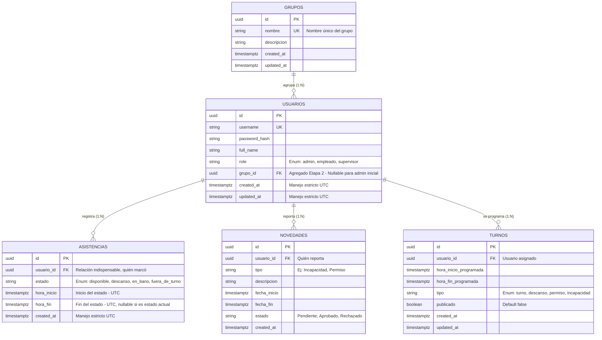

# Diagrama Entidad-Relación (ERD) — Workforce Management

Este documento actúa como la única fuente de la verdad para el diseño de la base de datos de WFM y evita la creación improvisada de relaciones o tablas por parte del Agente DBA.

### Reglas de Negocio Asociadas a la BD

1. **Fechas/Horas:** Todas las columnas de marcas temporales y fechas operan bajo el tipo de dato `TIMESTAMPTZ` nativo de PostgreSQL garantizando compatibilidad con cualquier zona horario mediante el Backend.

2. **Llaves Foráneas:** Las entidades transaccionales no pueden existir sin estar vinculadas a un UUID válido en `USUARIOS`. Los nuevos empleados obligatoriamente deben atarse a un `grupo_id`.

3. **Tabla ASISTENCIAS - Reglas Específicas (Etapa 4):**
   - Un usuario puede tener múltiples registros de asistencia por día
   - El estado actual siempre tiene `hora_fin` NULL
   - Al marcar un nuevo estado, el estado anterior debe cerrarse (actualizar `hora_fin`)
   - Estados válidos: `disponible`, `descanso`, `en_bano`, `fuera_de_turno`
   - El cálculo del tiempo total del día es: primer `disponible` → último `fuera_de_turno`

4. **Tabla TURNOS - Actualización (Etapa 3):**
   - Columna `tipo` para diferenciar tipo de programación
   - Columna `publicado` para control de visibilidad
   - Columna `updated_at` para auditoría de cambios
